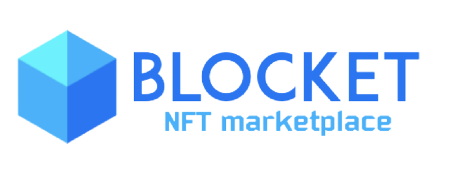

# NFT Marketplace



<p>
  
  
</p>

# Table of contents
- [NFT Marketplace [template]](#nft-marketplace-template)
- [Table of contents](#table-of-contents)
- [About](#about)
- [Installation](#installation)
  - [Git [optional]](#git-optional)
  - [Docker](#docker)
- [Usage](#usage)
- [Contributing](#contributing)
- [Help](#help)
- [Credits](#credits)

# About
...

# Installation
This part is dedicated to the prerequisites to launch the application.

## Git [optional]
You can download the project by pressing the ***Code/Download ZIP*** button on GitHub or else you can type the following command in your terminal if you have Git of course.

```
$ git clone https://github.com/rafidini/nft-marketplace.git
```

## Docker
> **Docker**
:
*Docker is a set of platform as a service products that use OS-level virtualization to deliver software in packages called containers. Containers are isolated from one another and bundle their own software, libraries and configuration files; they can communicate with each other through well-defined channels. - **Wikipedia***

You can download the desktop software by taking a look at this [link](https://www.docker.com/get-started).

In order to use the app you will have to install both ***Docker*** and ***Docker Compose***. The following instructions are compatible
with linux and macOs terminals.

1. Build the images with *Docker Compose*
```bash
$ docker-compose build
```

2. Run the container with *Docker Compose*
```bash
$ docker-compose up
```

# Usage
...

# Contributing
...

# Help
...

# Credits
...